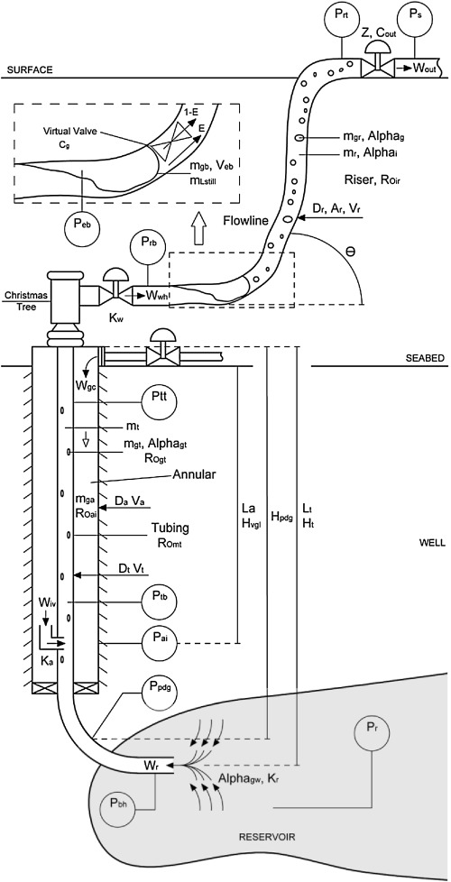

# Fast Offshore Wells Model (FOWM)

In this repo the FOWM, from [Diehl et al., 2017](https://www.sciencedirect.com/science/article/abs/pii/S0098135417300443), will be replicated using Julia Programming Language.

## System Representation
Here is a representation of the system available in the work of [Diehl et al., 2017](https://www.sciencedirect.com/science/article/abs/pii/S0098135417300443)

## Model

$$\dfrac{dm_{ga}}{dt} = W_{gc} - W_{iV}$$ (1)
$$\dfrac{dm_{gt}}{dt} = W_r\alpha_{gw} + W_{iV}-W_{whg}$$ (2)
$$\dfrac{dm_{lt}}{dt} = W_r(1-\alpha_{gw}) - W_{whl}$$ (3)
$$\dfrac{dm_{gb}}{dt} = (1-E)W_{whg}-W_g$$ (4)
$$\dfrac{dm_{gr}}{dt} = EW_{whg}+W_g-W_{gout}$$ (5)
$$\dfrac{dm_{lr}}{dt} = W_{whl}-W_{lout}$$ (6)
 
 

Being:

|   Variables   |                        Description                        |
| :-----------: | :-------------------------------------------------------: |
|   $m_{ga}$    |                 Gas mass in the annualar                  |
|   $m_{gt}$    |                  Gas mass in the tubbing                  |
|   $m_{lt}$    |                  Liq mass in the tubing                   |
|   $m_{gb}$    |                  Gas mass in the bubble                   |
|   $m_{gr}$    |                 Gas mass in the flowline                  |
|   $m_{lr}$    |                Liquid mass in the flowline                |
|   $W_{iV}$    |           Gas mass flow from annular to tubing            |
|    $W_{r}$    |          Reservoir to the bottom hole mass flow           |
|   $W_{whg}$   |                Gas mass flow at Xmas Tree                 |
|   $W_{whl}$   |                Liq mass flow at Xmas Tree                 |
|   $W_{gc}$    |                Gas lift mass flow annular                 |
|    $W_{g}$    |            Gas mass flow at the virtual valve             |
|  $W_{gout}$   |        Gas mass flow through topside valve (Choke)        |
|  $W_{lout}$   |        Gas mass flow through topside valve (Choke)        |
|      $E$      |         Mass fraction of gas bypassing the bubble         |
| $\alpha_{gw}$ | Gas mass fraction at resorvoir's pressure and temperature |

 
 

Where:

$$W_{iV} = K_a\sqrt{\rho_{ai}(P_{ai}-P_{tb})}$$ (7)
$$W_{r} = K_r \left [1 - 0.2\dfrac{P_{bh}}{P_{r}} - \left(0.8\dfrac{P_{bh}}{P_r}\right)^2 \right]$$ (8)
$$W_{whg} = K_w\sqrt{\rho_{L}(P_{tt}-P_{rb})}\alpha_{gt}$$ (9)
$$W_{whl} = K_w\sqrt{\rho_{L}(P_{tt}-P_{rb})}(1-\alpha_{gt})$$ (10)
$$W_{g} = C_g(P_{eb} - P_{rb}) $$ (11)
$$W_{gout} = \alpha_{gr} C_{out} z  \sqrt{\rho_L(P_{rt}-P_{s})}$$ (12)
$$W_{lout} = \alpha_{lr} C_{out} z  \sqrt{\rho_L(P_{rt}-P_{s})}$$ (13)

 
 

Being:

|   Variables   |                      Description                       |
| :-----------: | :----------------------------------------------------: |
|    $K_{a}$    |      Flow coefficient between annular and tubing       |
|    $K_{r}$    |              Resorvoir's flow coefficient              |
|    $K_{w}$    |             Flow coefficient at Xmas Tree              |
|  $\rho_{ai}$  |               Gas density in the annular               |
|  $\rho_{L}$   |           Liquid density (assumed constant)            |
| $\alpha_{gt}$ |              Gas mass fraction in tubing               |
| $\alpha_{gr}$ |        Gas mass fraction in the subsea pipeline        |
| $\alpha_{lr}$ |      Liquid mass fraction in the subsea pipeline       |
|    $C_{g}$    |              Virtual valve flow constant               |
|   $C_{out}$   |                  Choke valve constant                  |
|      $z$      |              Choke valve opening fraction              |
|    $P_{r}$    |                  Reservoir's Pressure                  |
|    $P_{s}$    |               Pressure after Choke valve               |
|   $P_{rt}$    |            Pressure at the top of the riser            |
|   $P_{rb}$    |       Pressure at the flowline before the bubble       |
|   $P_{tt}$    |             Pressure at the top of tubing              |
|   $P_{eb}$    |                    Bubble Pressure                     |
|   $P_{ai}$    | Pressure in the annular gas injection point to tubing  |
|   $P_{tb}$    | Pressure in the gas injection point on the tubing side |
|   $P_{bh}$    |              Pressure in the bottom hole               |

 
 
Where:

$$\rho_{ai} = \dfrac{MP_{ai}}{RT}$$ (14)
$$\alpha_{gt} = \dfrac{m_{gt}}{m_{gt}+m_{lt}}$$ (15)
$$\alpha_{gr} = \dfrac{m_{gr}}{m_{gr}+m_{lr}}$$ (16)
$$\alpha_{lr} = 1-\alpha_{gr}$$ (17)
$$P_{ai} = \left(\dfrac{RT}{V_aM} + \dfrac{gL_a}{V_a} \right)m_{ga} $$ (18)
$$P_{tb} = P_{tt} + \rho_{mt}gH_{vgl}$$ (19)
$$P_{bh} = P_{pdg} + \rho_{mres}g(H_t-H_{pdg})$$ (20)
$$P_{pdg} = P_{tb} + \rho_{mres}g(H_{pdg}-H_{vgl})$$ (21)
$$P_{tt} = \dfrac{\rho_{gt}RT}{M}$$ (22)
$$P_{rb} = P_{rt}+\dfrac{(m_{lr}+m_{L,still})gsin(\theta)}{A_{ss}}$$ (23)
$$P_{eb} = \dfrac{m_{gb}RT}{MV_{eb}}$$ (24)
$$P_{rt} = \dfrac{m_{gr}RT}{M\left(\omega_{u}V_{ss}-\dfrac{m_{lr}+m_{L,still}}{\rho_L}\right)}$$ (25)

 
 

Being:

|   Variables   |                Description                 |
| :-----------: | :----------------------------------------: |
|      $R$      |           Universal gas constant           |
|      $T$      |            Average temperature             |
|      $M$      |            Gas molecular weight            |
|  $\rho_{mt}$  |              Mixture density               |
| $\rho_{mres}$ |            Reservoir's density             |
|  $\rho_{gt}$  |                Gas density                 |
|      $g$      |            Gravity acceleration            |
|    $V_{a}$    |               Annular volume               |
|   $V_{eb}$    |               Bubble Volume                |
|   $V_{ss}$    |    Pipe volume downstream virtual valve    |
|    $H_{t}$    |  Vertical length Xmas Tree - Bottom Hole   |
|   $H_{pdg}$   |   Vertical length Xmas Tree - PDG point    |
|   $H_{vgl}$   |    Vertical length Xmas Tree - Gas Lift    |
|   $A_{ss}$    |         Riser cross sectional area         |
|    $L_{a}$    |               Annular length               |
| $m_{L,still}$ | Minimum mass of liq in the subsea pipeline |
| $\omega_{u}$  |   Bubble Location (assistant parameter)    |
|   $\theta$    |         Average riser inclination          |

 
 

Where:

$$\rho_{mt} = \dfrac{m_{gt}+m_{lt}}{V_t}$$ (26)
$$\rho_{gt} = \dfrac{m_{gt}}{V_{gt}}$$ (27)
$$V_{gt} = V_t - \dfrac{m_{lt}}{\rho_L}$$ (28)
$$A_{ss} = \dfrac{\pi D_{ss}^2}{4}$$ (29)
$$V_{ss} = \dfrac{\pi D_{ss}^2L_r}{4}+\dfrac{\pi D_{ss}^2L_{fl}}{4}$$ (30)
$$V_a = \dfrac{\pi D_{a}^2L_a}{4}$$ (31)
$$V_t = \dfrac{\pi D_{t}^2L_t}{4}$$ (32)

 
 

Being:

| Variables |       Description        |
| :-------: | :----------------------: |
|   $V_t$   |     Volume of tubing     |
| $V_{gt}$  | Gas volume in the tubing |
|   $L_r$   |       Riser length       |
| $L_{fl}$  |     Flowline length      |
|   $L_t$   |      Tubing length       |
|   $D_a$   |     Annular diameter     |
|   $D_t$   |     Tubing diameter      |
| $D_{ss}$  | Subsea pipeline diameter |

## Simulation

### Parameters

|   Variables   |         Value         |   Unit    |
| :-----------: | :-------------------: | :-------: |
|   $\rho_L$    |         $900$         | $kg/m^3$  |
|     $P_r$     |         $225$         |   $bar$   |
|     $P_s$     |         $10$          |   $bar$   |
| $\alpha_{gw}$ |       $0.0188$        |    $-$    |
| $\rho_{mres}$ |         $892$         | $kg/m^3$  |
|      $M$      |         $18$          | $kg/kmol$ |
|      $T$      |         $298$         |    $K$    |
|    $L_{r}$    |        $1569$         |    $m$    |
|   $L_{fl}$    |        $2928$         |    $m$    |
|    $L_{t}$    |        $1639$         |    $m$    |
|    $L_{a}$    |        $1118$         |    $m$    |
|    $H_{t}$    |        $1279$         |    $m$    |
|   $H_{pdg}$   |        $1117$         |    $m$    |
|   $H_{vgl}$   |         $916$         |    $m$    |
|   $D_{ss}$    |        $0.15$         |    $m$    |
|    $D_{t}$    |        $0.15$         |    $m$    |
|    $D_{a}$    |        $0.14$         |    $m$    |
| $m_{L,still}$ | $6.222\times 10^{+1}$ |    kg     |
|    $C_{g}$    | $1.137\times 10^{-3}$ |    $-$    |
|   $C_{out}$   | $2.039\times 10^{-3}$ |    $-$    |
|   $V_{eb}$    | $6.098\times 10^{+1}$ |   $m^3$   |
|      $E$      | $1.545\times 10^{-1}$ |    $-$    |
|    $K_{w}$    | $6.876\times 10^{-4}$ |    $-$    |
|    $K_{a}$    | $2.293\times 10^{-5}$ |    $-$    |
|    $K_{r}$    | $1.269\times 10^{+2}$ |    $-$    |
| $\omega_{u}$  | $2.780\times 10^{0}$  |    $-$    |